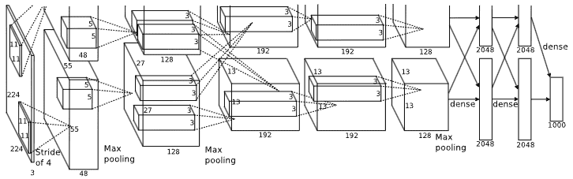

+++
title = "AlexNet论文精读"
summary = ""
categories = ["深度学习"]
tags = ["深度学习"]
series = []

lastmod = "2025-10-26T15:47:50+08:00"
draft = false
math = true

date = "2025-10-08T21:45:00+08:00"
archives = '2025-10'
isCJKLanguage = true
+++

原论文：[ImageNet Classification with Deep Convolutional Neural Networks](https://doi.org/10.1145/3065386)

作者：Alex Krizhevsky, Ilya Sutskever, and Geoffrey E. Hinton

发表于：[Advances in Neural Information Processing Systems 25 (NIPS 2012)](https://proceedings.neurips.cc/paper_files/paper/2012)

---

#### 摘要

我们训练了一个大型深度卷积神经网络，该模型用于在ImageNet LSVRC-2010比赛中对1000种不同类别的120万张高分辨率图像进行分类。  
在测试数据中，我们达成了37.5%的top-1错误率和17.0%的top-5错误率，显著优于此前的最先进水平。  
该神经网络有6000万个参数、65万个神经元，由5层卷积层组成，其中有些卷积层后有最大池化层，以及三个全连接层，最后是1000分类的softmax输出。  
为了训练得更快，我们使用了非饱和神经元，以及一个非常高效的GPU实现的卷积操作。  
为了减少全连接层的过拟合，我们使用了一个近期提出的正则化方法“dropout”，它被证明十分有效。  
我们也将该模型的变体提交到了ILSVRC-2012比赛中，以15.3%的top-5测试错误率获得第一名，而第二名的错误率是26.2%.

#### 1. 引言

当前物体识别方法充分利用了机器学习方法。  
为了提升性能，我们可以收集更大的数据集，学习更强力的模型，使用更好的技术以预防过拟合。  
直到现在，带标签的图像数据集仍然相对较小——在几万张图片的数量级上（例如NORB,Caltench-101/256，以及CIFAR-10/100）。  
使用这个大小的数据集可以很好地解决一些简单的识别任务，尤其是通过保持标签不变的数据变换进行数据扩充时。  
例如，针对MNIST数字识别任务最优的错误率（<0.3%）已经达到人类水平。  
但是现实中的物体展现出了很大的变化性，所以要学习识别它们就需要更大的训练数据集。  
事实上，小图像数据集的缺点已经被广泛承认（例如Pinto等），但直到最近，收集数百万张图片的带标签数据才成为可能。  
这些新的大数据集包括LabelMe，它包含数十万被完全分割的图像，以及ImageNet，它包含超过1500万带标签的高分辨率图像、涵盖22000个类别。

为了从数百万图像中学习几千种物体，我们需要一个大学习容量的模型。  
然而，物体识别任务极大的复杂度意味着，即使像ImageNet这样的大数据集也无法覆盖这个问题的所有情况。所以我们的模型应该也要有大量的先验知识，以弥补缺少的数据。  
卷积神经网络(CNNs)就构成了这一类模型。  
它们的容量可以通过改变深度和宽度来控制，并且它们也对图像的本质做了很强、几乎正确的假设（也就是说，**统计特性稳定性**和**像素依赖局部性**）。  
因此，相比于具有相似尺寸的标准前馈神经网络，CNNs有更少的连接和参数，所以它们更容易训练，同时它的理论最优性能可能仅略低于前者。

> **统计特性稳定性**(Stationarity of Statistics)：指图像不同区域的平均亮度、对比度等统计属性不会剧烈变化。  
> **像素依赖局部性**（Locality of Pixel Dependencies）：像素之间的关系（如边缘、纹理）主要取决于局部相邻相像，而不是远处的像素。

尽管CNNs有诸多优点，尽管其局部架构相对高效，当应用于大规模高分辨率图像时，其代价仍然很高。  
幸运的是，当前的GPU结合上高度优化的2D卷积实现，已经有足够的能力训练很大的CNNs以及像ImageNet这样包含足够多标签样本的近期的数据集，并且没有严重的过拟合。

本文的特别贡献如下：我们在ILSVRC-2010和ILSVRC-2012所使用的ImageNet子集上，训练了一个目前最大的卷积神经网络之一，并且取得了在此数据集上迄今为止最好的结果。  
我们写了一个高度优化的2D卷积GPU实现，以及其它用于训练卷积神经网络的原生操作，并将其公开。  
我们的网络包含一系列新的、不同寻常的特点，提升了其性能并且减少其训练时间，这将在第三章节详细描述。  
即使有120万带标签的样本数据，该网络的尺寸仍使过拟合成为了一个显著问题，所以我们使用了一些有效的技术去降低过拟合，这将在第4章节介绍。  
我们最后的网络包括5层卷积层和3个全连接层，而且它的深度似乎很重要：我们发现移除任意一个卷积层（每一个都含有不超过1%的模型参数）都会导致性能下降。

最后，该网络的尺寸主要受限于当前GPU可用显存以及我们能容忍的训练时间上。  
我们所有的实验结果都表明，我们的测试结果可以简单地通过等待更快的GPU和更大的数据集可用来提高。

#### 2. 数据集

ImageNet是一个超过150万张带标签高分辨率图片的数据集，涵盖大约22000个类别。  
这些图片收集自互联网，并且使用Amazon的Mechanical Turk众包工具、由人工标记。  
自2010年起，作为Pascal Visual Object Challenge的一部分，一个名为ImageNet大规模视觉识别挑战（ILSVRC）的年度比赛开始举办。  
ILSVRC使用ImageNet的一个子集，大约有1000个类别，每类约1000张图片。  
总体上，它们有约120万训练图片，5万验证图片和15万测试图片。  

ILSVRC-2010是唯一一场测试标签可用的ILSVRC比赛，所以我们在这个版本上进行了大部分实验测试。 
因为我们的模型也参赛了ILSVRC-2012，在第6章节我们也展示了在此版本上的结果，该版本数据集测试标签不可用。  
在ImageNet中，习惯于使用两种错误率：top-1和top-5，top-5错误率就是正确标签未能出现于前5个最大概率预测标签中的测试图片的比例。

ImageNet的图片具有变化的分辨率，而我们的系统需要一个常量维度的输入。  
因此，我们将图片下采样到一个固定分辨率256\*256。  
给定一个矩形图片，我们首先缩放其短边到256长度，然后从缩放图片中截取中间256\*256的部分。  
我们没有对图片进行其它任何预处理，除了将图片上每个像素减去整个训练集上的平均强度。  
所以我们在像素（中心化处理后的）原生RGB值上训练了我们的网络。

#### 3. 模型架构

我们的模型结构可概括为图2。  
它包含8个学习层——5个卷积层和3个全连接层。  
下面我们描述了我们模型中一些新的或者不常见的特点。  
3.1到3.4节按我们所预估的重要程序排序，重要者在前。

##### 3.1 ReLU非线性

建模一个神经元输出的标准方式是 \(f(x)=tanh(x)\) 或者 \(f(x)=(1+e^{-x})^{-1}\)，\(f\)是一个输入为\(x\)的函数。  
就梯度下降训练时间而言，这些饱和非线性要比不饱和非线性函数 \(f(x)=max(0,x)\) 要慢很多。  
沿用Nair和Hinton的研究成果，我们参考了称为线性整流单元（ReLUs）的非线性神经元。  
训练带有ReLUs的深度卷积神经网络比带有tanh单元的同等网络要快得多。  
如图1，它展示了在CIFAR-10数据集上训练一个特定的4层卷积网络达到25%错误率时所用的迭代数。  
这张图表明如果我们使用传统饱和神经元模型，我们将无法在本工作中对如此大的神经网络进行实验。



我们不是首个考虑在CNNs中寻找传统神经元模型替代品的。  
例如Jarrett等人称，在Caltech-101数据集上使用对比度归一化后接局部平均池化时，非线性函数 \(f(x)=|tanh(x)|\) 的效果特别好。  
然而，在此数据集中，主要考虑的是防止过拟合，所以他们所观察的效果与本文中使用ReLUs去学习训练集的加速能力是有所不同的。  
更快的学习对大模型在大数据集上的性能有巨大的影响。  

##### 3.2 在多GPU上训练

单块GTX 580 GPU仅有3GB显存，限制了在其上训练的网络最大尺寸。  
对于在单块GPU上训练时显得过大的模型，120万个训练样本是足够的。  
所以我们将网络分散在两块GPU上。  
当前的GPU十分适合跨GPU并行，因为它们能够不通过主机内存直接读写另一块显卡的显存。  
我们所使用的这个并行架构将一半的卷积核（或神经元）分布在每个GPU上，再加上一个额外的技巧：这些GPU只在特定层通信。  
这意味着，第三层的卷积核从所有第二层卷积特征图中读取输入。  
然而，第四层卷积核仅从位于相同GPU上的第三层卷积特征图中读取输入。  
选择连接模式是一个需要交叉验证来解决的问题，但这允许我们精确地调整通信的数量，直到计算量变得可接受。

> 这里的“交叉验证”不是通常所说的数据集的k折交叉验证，而是说“通过尝试不同连接结构，调整到一个最优的训练效果”，是个更广泛的含义。

最终的架构与Ciresan等人所用的“分列式”CNN有些相似，除了我们的多列之间是非独立的（见图2）。  
与在单GPU训练的、每个卷积层中卷积核数量只有一半的网络相比，这个架构分别将top-1错误率和top-5错误率降低了1.7%和1.2%。  
两GPU网络训练时间略少于单GPU网络。  

##### 3.3 局部响应归一化（Local Response Normalization）

ReLUs有一个理想的属性，它不需要为防止饱和而对输入进行归一化。  
如果至少有某个训练样本对ReLU产生了一个正值输入，神经元就会学习。  
然而，我们仍然发现下面的局部归一化方案有助于泛化。  
记 \(a^i_{x,y}\) 为卷积核\(i\)计算得到的像素\((x,y)\)位置上的激活值，之后应用于ReLU非线性激活函数，其响应归一化激活值 \(b^i_{x,y}\) 通过下式给出：
$$ b^i_{x,y} = \frac{a^i_{x,y}}{[k+\alpha \sum\nolimits_{j=max(0,i-n/2)}^{min(N-1,i+n/2)}{(a^j_{x,y})^2}]^\beta} $$
其中的求和项遍历自相同像素位置上的n个临接卷积图，N是当前层总核数。  
卷积图的顺序当然是任意的，在开始训练之前就确定的。  
这类响应归一化实现了一种启发于真实神经元的**侧抑制**(Lateral Inhibition)，创造了不同卷积核输出之间对于大激活值的竞争。  
其常量\(k\)，\(n\)，\(\alpha\)和\(\beta\)是用验证数据集确定下来的超参数；我们使用\(k=2\)，\(n=5\)，\(\alpha=10^{-4}\)，以及\(\beta=0.75\)。  
我们在特定层上在ReLU激活函数后应用这个归一化（见3.5节）。

> 侧抑制：指相邻神经元间相互抑制的现象。当某一神经元收刺激兴奋时，邻近神经元产生的兴奋会抑制其活动。该现象由Hartline和Rattliff于1956年发现。

本方案与Jarrett等人的局部对比度归一化享有相似性，但是我们的版本更准确来说应该叫“亮度归一化”，因为我们没有减去平均强度。  
响应归一化分别将top-1和top-5错误率降低了1.4%和1.2%。  
我们也在CIFAR-10数据集上验证了该方案的有效性：一个不用归一化的四层CNN实现了13%的错误率，而使用归一化则为11%。

> 我在此有个疑惑，这里的卷积核“相邻”似乎没有什么意义。因为卷积核是按结构定义顺序编号的，编号相邻但它们其实没有什么空间或逻辑上的位置关系（又不是像素）。  
> 或许取某层中相邻n个核的输出作平均，与取随机n个核的输出作平均，效果应该差不多吧？

##### 3.4 重叠池化（Overlapping Pooling）

CNN中的池化层汇总了同一个核特征图中相邻的神经元组。  
传统上，这些被邻接池化单元汇总的神经元们并不重叠。  
更准确地说，一个池化层可以被看作由池化单元网格组成，这些池化单元各自相距s个像素，每一个单元汇总了位于其中心 \(z \times z\) 大小的相邻神经元。  
如果我们设置 \(s=z\)，我们获得了常用于CNN中的传统的局部池化。  
如果我们设置 \(s < z\)，我们就获得了重叠池化，这就是在我们的网格模型中普遍使用的，\(s=2\)且\(z=3\)。  
与采用 \(s=2,z=2\) 、产生相同维度输出的非重叠方案相比，这个方案将top-1和top-5错误率分别降低了0.4%和0.3%。  
我们在训练过程中普遍观察到，使用重叠池化的模型轻微地更难过拟合。

##### 3.5 整体架构

现在我们准备好介绍我们CNN模型的整体架构了。  
如图2所示，该网络包含8个带权层；前五个是卷积层，剩余三个是全连接层。  
最后全连接层的输出被喂给1000路softmax，它生成了在这1000类别标签上的分布。  
我们的网络最大化了多项逻辑回归的目标函数，这等价于最大化了整个训练集正确标签在预测分布下的对数概率的平均值。

第二、四、五个卷积层的卷积核仅连接了位于相同GPU上的前一层的卷积图（见图2）。  
第三个卷积层的卷积核连接了第二层的所有卷积图。  
全连接层的神经元连接了其前一层的所有神经元。  
第一、二层卷积层后，设置了局部响应归一化层。  
在两个局部响应归一化层后，以及第五个卷积层后，设置了3.4节中所描述的最大池化层。  
每个卷积层和全连接层的输出之后，应用了ReLU非线性激活函数。

第一个卷积层使用96个 \(11 \times 11 \times 3\) 的核来对 \(224 \times 224 \times 3\) 的输入图像进行滤波，使用4个像素的步幅（这是特征图中邻居神经元感受野中心之间的距离）。  
第二个卷积层以第一个卷积层的结果（经过了响应归一化、池化处理）作为输入，并且以256个尺寸为 \(5 \times 5 \times 58\) 的核来对其进行滤波。  
第三、四、五个卷积层依次相连，没有任何中间池化或标准化层。  
第三个卷积层有384个 \(3 \times 3 \times 256\) 的核，与（标准化、池化后的）第二层卷积输出相连。  
第四层卷积层有384个 \(3 \times 3 \times 192\) 的核，第五层卷积有256个 \(3 \times 3 \times 192\) 的核。  
每个全连接层有4096个神经元。

#### 4. 降低过拟合

我们的神经网络架构共有6000万参数。  
尽管ILSVRC的1000个类别使得每个样本对"图像到标签映射"施加10比特的约束，在不考虑过拟合的情况下，这也被证明是不够学习如此之多参数的。  
下面，我们描述了我们对抗过拟合的两种主要方式。

> 这里第二句有点让人疑惑，原句是"Although the 1000 classes of ILSVRC make each training example impose 10 bits of constraint on the mapping from image to label, this turns out to be insufficient to learn so many parameters without considerable overfitting."。这里10 bits是说1000种类别大概需要10个比特位来存储（\(2^{10}\)），作者要说的是"6000万参数"这个模型的表达能力非常大，而数据集所包含的总信息量（"每样本10比特" \(\times\) "每类别1000张图片"）相比这6000万参数来说还是太少了，很容易过拟合，必须要考虑这个问题，然后顺着引出了本章的内容。

##### 4.1 数据增广

##### 4.2 Dropout

#### 5. 训练的细节

#### 6. 结果

##### 6.1 定性评估

#### 7. 讨论
