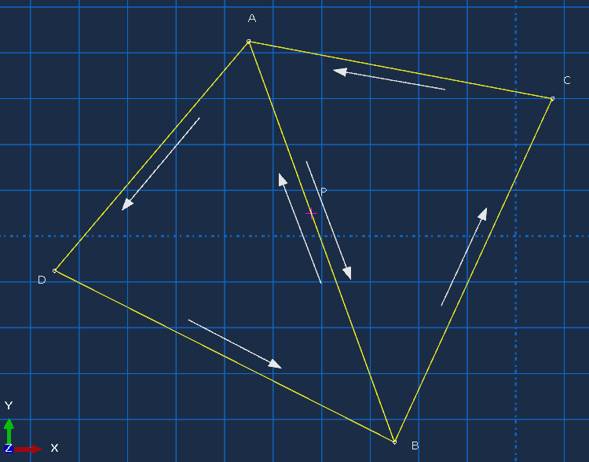
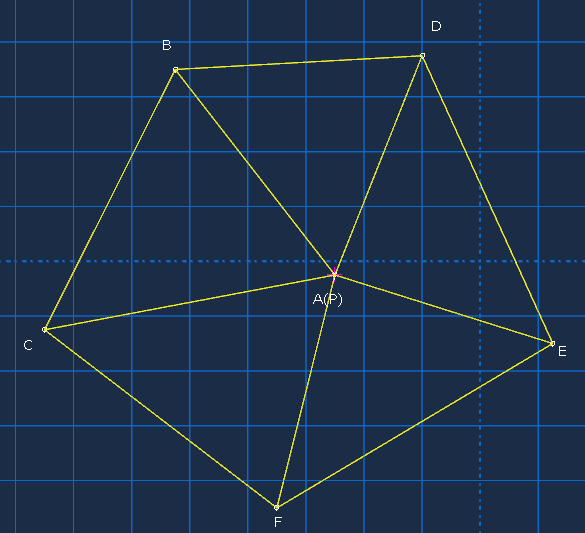

+++
title = "射线交叉法判断点是否位于几何体内部"
summary = ""
categories = ["图形学"]
tags = ["图形学"]
series = []

lastmod = "2025-04-13T23:29:52+08:00"

date = "2025-04-09T23:51:57+08:00"
archives = '2025-04'
isCJKLanguage = true

params.math = true
+++

**射线交叉法**可以用来计算一点是否在几何体内部，在本文中用于初始化有符号距离场的符号。其思路是，从网格内每一个点开始，沿x轴正向（沿任意一个方向均可）发出一条射线，判断这条射线穿过几何表面的次数，奇数次为内部点，偶数次为外部点。

下面先贴出来计算用到的概念和公式。

#### 叉积/向量积/外积
三维空间中两个向量的叉积：

$$\textbf{u} \times \textbf{v} = |\textbf{u}||\textbf{v}|\sin\theta\textbf{n}$$

矩阵表示：
$$\textbf{u} \times \textbf{v} =
\begin{vmatrix}
\textbf{i} & \textbf{j} & \textbf{k} \\
u_1 & u_2 & u_3 \\
v_1 & v_2 & v_3
\end{vmatrix}
$$

**几何意义**：叉积的结果是一个向量，模长等于两个向量为边所构成的平行四边形的面积，方向与两向量垂直，由右手定则决定。

#### 有向面积

平面中\(\Delta{ABC}\)，其中点\(A(x_A, y_A)\)，\(B(x_B, y_B)\)，\(C(x_C, y_C)\)。三角形的有向面积计算公式：

$$S_\Delta = \frac{1}{2}
\begin{vmatrix}
x_A & y_A & 1 \\
x_B & y_B & 1 \\
x_C & y_C & 1
\end{vmatrix}
$$

若A、B、C是逆时针方向排列，则三角形的有向面积是正的，顺时针为负，三点共线则为零。

**应用**：判断点D是否在\(\Delta{ABC}\)内部。

方法1（符号法）：连接DA、DB、DC，若\(\Delta{DAB}\)、\(\Delta{DBC}\)、\(\Delta{DCA}\)的有向面积与\(\Delta{ABC}\)的有向面积符号相同，则点D在\(\Delta{ABC}\)内部。

方法2（面积法）：当D在三角形ABC内部或边界上时，当且仅当\(S_{\Delta{ABC}}=S_{\Delta{DAB}}+S_{\Delta{DBC}}+S_{\Delta{DCA}}\)

#### 三角形内一点的重心坐标

在三角形ABC中，对于三角形内任意一点P，存在一组实数\((\lambda_A,\lambda_B,\lambda_C)\)满足\(\lambda_A+\lambda_B+\lambda_C=1\)，并且点P的位置可以通过如下关系定义：

$$\overrightarrow{OP}=\lambda_A\overrightarrow{OA}+\lambda_B\overrightarrow{OB}+\lambda_C\overrightarrow{OC}$$

其中O是平面内任选的参考点，通常选三角形某个顶点以便于计算。这组实数\((\lambda_A,\lambda_B,\lambda_C)\)就是P点关于三角形ABC的重心坐标。

**重心坐标与面积比之间的关系**：P点关于三角形ABC的重心坐标中每个分量之比，等于P所在三个小三角形与该大三角形的面积之比：

$$S_{\Delta{PBC}}:S_{\Delta{PCA}}:S_{\Delta{PAB}}=\lambda_A:\lambda_B:\lambda_C$$

#### 代码实现

---

> - 输入一点p，以及一个封闭STL实体，以及一个包围盒内的网格节点。对每一个节点：
> - 遍历每一个三角面片，对每一个面片：
> - 在x轴方向正投影平面上，判断点P是否在三角形内部。如果否，标记该节点为外部点并返回。
> - 如果是内部，就计算它的重心坐标分量比（面积比），此时我们已知了交点的y,z坐标，需要进一步求出交点x坐标。
> - 用重心坐标定义，求出交点的x坐标。
> - 判断P的x坐标与交点x坐标的大小，可知道该点位于面片前方还是后方，只对前一种情况统计穿过次数。
> - 统计穿过次数，如果为偶数，则标记该节点在几何体外部；奇数为内部。
> - 符号场初始化完成。

每一个节点的判断逻辑是独立的，很容易用GPU并行实现。

---

```cpp
#include <gtest/gtest.h>

#include "../define.h"
#include "../stl.h"

// 计算三角形 O(0, 0) A(x1, y1) B(x2, y2) 的有向面积, OAB逆时针排列时是正
int orientation(float x1, float y1, float x2, float y2, float& twice_signed_area) {
    twice_signed_area = x1 * y2 - x2 * y1;
    if (twice_signed_area > 0) return 1;
    else if (twice_signed_area < 0) return -1;
    // twice_signed_area 为0, 有可能是OAB共线(或AB重合), 此时点可能在边AB上, 此时根据AB的关系返回其符号
    // 区分以下几种情况, 是为了避免点位于两相邻三角形的共向边上时重复计数
    else if(y1 > y2) return 1;
    else if(y1 < y2) return -1;
    else if(x1 < x2) return 1;
    else if(x1 > x2) return -1;
    else return 0;  // 此时OAB三点有任意两点重合, 直接认为在三角形外
}

// 判断平面上一点P(x0, y0)是否在三角形ABC内部, 其中 A(x1, y1), B(x2, y2), C(x3, y3)
// 如果在内部, 顺便计算其重心坐标(lambda_a, lambda_b, lambda_c), 其中 lambda_a + lambda_b + lambda_c = 1
// 重心坐标与面积存在关系 lambda_a : lambda_b : lambda_c = Spbc : Spca : Spab
bool point_in_triangle_2d(float x0, float y0, float x1, float y1, float x2, float y2, float x3, float y3, float& lambda_a, float& lambda_b, float& lambda_c) {
    // 将坐标原点移到x0, y0, 简化处理
    x1 -= x0; x2 -= x0; x3 -= x0;
    y1 -= y0; y2 -= y0; y3 -= y0;

    int sign1 = orientation(x2, y2, x3, y3, lambda_a);  // 三角形PBC 的有向面积*2
    if (sign1 == 0) return false;  // 此时面片与x轴平行, 认为不相交
    int sign2 = orientation(x3, y3, x1, y1, lambda_b);  // 三角形PCA
    if (sign2 != sign1) return false;  // 符号不同, 在三角形外部
    int sign3 = orientation(x1, y1, x2, y2, lambda_c);  // 三角形PAB
    if (sign3 != sign1) return false;  // 符号不同, 在三角形外部

    // 面积比归一化为重心坐标
    float sum = lambda_a + lambda_b + lambda_c;
    lambda_a /= sum;
    lambda_b /= sum;
    lambda_c /= sum;

    return true;
}

// 从p点出发, 沿x正向发出射线, 判断是否与三角面片相交, 如果相交则计算其交点位置
bool ray_casting(const Vertice& p, const Triangle& tri, Vertice& intersection) {
    float lambda_a, lambda_b, lambda_c;
    // 判断点与三角形在x方向的正投影有没有相交
    if (point_in_triangle_2d(p.y, p.z,
                         tri.vertices[0].y, tri.vertices[0].z,
                         tri.vertices[1].y, tri.vertices[1].z,
                         tri.vertices[2].y, tri.vertices[2].z,
                         lambda_a, lambda_b, lambda_c)) {
        intersection.x = lambda_a * tri.vertices[0].x + lambda_b * tri.vertices[1].x + lambda_c * tri.vertices[2].x;
        intersection.y = lambda_a * tri.vertices[0].y + lambda_b * tri.vertices[1].y + lambda_c * tri.vertices[2].y;
        intersection.z = lambda_a * tri.vertices[0].z + lambda_b * tri.vertices[1].z + lambda_c * tri.vertices[2].z;

        return intersection.x > p.x;  // 射线沿x轴正方向行走, 面片如果在p的左侧, 则不算穿过
    }
    return false;
}

TEST(SDFTest, test_ray_casting) {
    std::vector<::Triangle> triangles;
    Vertice min_bound, max_bound;
    STL::read_binary_stl("../data/grain_bin.stl", triangles, min_bound, max_bound);
    EXPECT_EQ(triangles.size(), 780);

    Vertice p((max_bound - min_bound)*0.3);
    printf("p (%f, %f, %f)\n", p.x, p.y, p.z);

    uint count = 0;
    for (int i = 0; i < triangles.size(); i++) {
        Vertice intersection;
        if (ray_casting(p, triangles[i], intersection)) {
            printf("\nintersection %d:\n", count);
            printf("\tintersection (%f, %f, %f)\n", intersection.x, intersection.y, intersection.z);
            printf("\ttriangle A(%f, %f, %f) B(%f, %f, %f) C(%f, %f, %f)\n\n",
                   triangles[i].vertices[0].x, triangles[i].vertices[0].y, triangles[i].vertices[0].z,
                   triangles[i].vertices[1].x, triangles[i].vertices[1].y, triangles[i].vertices[1].z,
                   triangles[i].vertices[2].x, triangles[i].vertices[2].y, triangles[i].vertices[2].z
                   );
            count++;
        }
    }

    printf("count=%d\n", count);
}

int main(int argc, char **argv) {
    ::testing::InitGoogleTest(&argc, argv);
    return RUN_ALL_TESTS();
}
```

#### 一个关键问题，刚好落在三角形边上或顶点上的点算不算穿过面片？

以上代码实现中，落在三角形边上或顶点上的点O，返回的三角形OAB的有向面积等于0，但仍需要对不同情况进行区分。

当三角形OAB有向面积为零时，有可能
1. 三角形其中两点重合（别忘了它是空间三角形在x方向的正投影）。此时要么射线刚好穿过顶点，要么面片与射线平行。
2. 三个点共线，分两种情况，AB指向正方向或负方向，此时AB的方向来决定其符号。

以下这段逻辑来处理有向面积为零时的不同情况：

```cpp
int orientation(float x1, float y1, float x2, float y2, float& twice_signed_area) {
    twice_signed_area = x1 * y2 - x2 * y1;
    if (twice_signed_area > 0) return 1;
    else if (twice_signed_area < 0) return -1;
    else if(y1 > y2) return 1;
    else if(y1 < y2) return -1;
    else if(x1 < x2) return 1;
    else if(x1 > x2) return -1;
    else return 0;
}
```

---

对于射线落在共享边的情形，该处理可以保证只被计数一次。如下图，P点与（有向）边AB组成的三角形PAB有向面积为正0，而与边BA组成三角形PBA的有向面积为负0，最终判定P与三角形ABC相交，与三角形ADB不相交。



测试代码：

```cpp
// 射线交点在共享边
TEST(SDFTest, test_point_in_triangle_2d) {
    // p (0, 0)
    // A (-1, 5)
    // B (1, -5)
    // C (5, 3)
    // D (-6, -2)

    float a, b, c;

    // P是否在ABC内部
    bool b1 = point_in_triangle_2d(0.0f, 0.0f,
                                   -1.0f, 5.0f,
                                   1.0f, -5.0f,
                                   5.0f, 3.0f,
                                   a, b, c
    );

    // P是否在ADB内部
    bool b2 = point_in_triangle_2d(0.0f, 0.0f,
                                   -1.0f, 5.0f,
                                   -6.0f, -2.0f,
                                   1.0f, -5.0f,
                                   a, b, c
    );

    ASSERT_TRUE(b1);
    ASSERT_FALSE(b2);
}
```

---

对于射线落在共享顶点的情况，计数也是正确的，如下情形，只会对三角形AED判定穿过。



测试代码：

```cpp
// 射线交点在共享顶点
TEST(SDFTest, test_point_in_triangle_2d_2) {
    // p (0, 0)
    // A (0, 0)
    // B (-3, 5)
    // C (-5, -2)
    // D (3, 6)
    // E (4, -3)
    // F (-1, -6)
    Vertice p(0.0f, 0.0f, 0.0f);
    Vertice A(0.0f, 0.0f, 0.0f);
    Vertice B(-3.0f, 5.0f, 0.0f);
    Vertice C(-5.0f, -2.0f, 0.0f);
    Vertice D(3.0f, 6.0f, 0.0f);
    Vertice E(4.0f, -3.0f, 0.0f);
    Vertice F(-1.0f, -6.0f, 0.0f);

    float a, b, c;

    std::vector<std::vector<Vertice>> test_case = {{p, A, B, C}, {p, A, C, F}, {p, A, F, E}, {p, A, E, D}, {p, A, D, B}};
    std::vector<bool> result;
    std::vector<bool> assertion = { false, false, false, true, false };
    for (const auto& v : test_case) {
        bool ret = point_in_triangle_2d(v[0].x, v[0].y,
                             v[1].x, v[1].y,
                             v[2].x, v[2].y,
                             v[3].x, v[3].y,
                             a, b, c
                             );
        result.push_back(ret);
    }

    for (int i = 0; i < result.size(); i++) {
        ASSERT_EQ(result[i], assertion[i]);
    }
}
```

这个算法来自:
[mesh2sdf - https://github.com/wang-ps/mesh2sdf/blob/master/csrc/makelevelset3.cpp](https://github.com/wang-ps/mesh2sdf/blob/master/csrc/makelevelset3.cpp)

---

2025.04.13 补充：实测上面的代码有几率会错判（内点判为外，外点判为内）。原因是float的精度问题，大部分情况下不会出现0面积，所以需要做一个修正：

```cpp
__device__ int orientation(float x1, float y1, float x2, float y2, float& twice_signed_area) {
    twice_signed_area = x1 * y2 - x2 * y1;
//    if (twice_signed_area != 0.0f && abs(twice_signed_area - 0) < FLOAT_TOLERANCE) printf("float error!!\n");
    if (abs(twice_signed_area - 0) < FLOAT_TOLERANCE) {  // 小于一定容差的都算为0, 避免误判
        if(y1 > y2) return 1;
        else if(y1 < y2) return -1;
        else if(x1 < x2) return 1;
        else if(x1 > x2) return -1;
        else return 0;
    } else {
        if (twice_signed_area > 0) return 1;
        else return -1;
    }
}
```

这个代码运行得很好。

测试代码：

```cpp
//
// Created by wangh on 2025/4/13.
//

#include <gtest/gtest.h>

#include <cuda_runtime.h>
#include "../define.h"
#include "../stl.h"

Grid field_grid;
std::vector<float> field;
std::vector<Triangle> triangles_cube;
std::vector<Vertice> vertices;

float *d_field;
Grid *d_grid;
Triangle *d_triangles_cube;

void create_cube() {
    // 正方体8个顶点
    vertices = {
            {0.0f, 0.0f, 0.0f},
            {1.0f, 0.0f, 0.0f},
            {1.0f, 0.0f, 1.0f},
            {0.0f, 0.0f, 1.0f},
            {0.0f, 1.0f, 0.0f},
            {1.0f, 1.0f, 0.0f},
            {1.0f, 1.0f, 1.0f},
            {0.0f, 1.0f, 1.0f}
    };

    // 向x,y,z轴三个方向平移1
//    Vertice v1 = {1.0f, 1.0f, 1.0f};
//    for (Vertice& vertice : vertices) {
//        vertice = vertice + v1;
//    }

    triangles_cube = {{vertices[1 - 1], vertices[2 - 1], vertices[3 - 1]},
                      {vertices[1 - 1], vertices[3 - 1], vertices[4 - 1]},
                      {vertices[4 - 1], vertices[3 - 1], vertices[7 - 1]},
                      {vertices[4 - 1], vertices[7 - 1], vertices[8 - 1]},
                      {vertices[8 - 1], vertices[7 - 1], vertices[6 - 1]},
                      {vertices[8 - 1], vertices[6 - 1], vertices[5 - 1]},
                      {vertices[5 - 1], vertices[6 - 1], vertices[2 - 1]},
                      {vertices[5 - 1], vertices[2 - 1], vertices[1 - 1]},
                      {vertices[2 - 1], vertices[6 - 1], vertices[7 - 1]},
                      {vertices[2 - 1], vertices[7 - 1], vertices[3 - 1]},
                      {vertices[5 - 1], vertices[1 - 1], vertices[4 - 1]},
                      {vertices[5 - 1], vertices[4 - 1], vertices[8 - 1]},
    };

    STL::write_ascii_stl("./cube.stl", triangles_cube);
}

void init_cuda_memory() {
    cudaMalloc((void**)&d_field, field.size() * sizeof(float));
    cudaMalloc((void**)&d_triangles_cube, triangles_cube.size() * sizeof(Triangle));
    cudaMalloc((void**)&d_grid, sizeof(Grid));

    cudaMemcpy(d_field, field.data(), field.size() * sizeof(float), cudaMemcpyHostToDevice);
    cudaMemcpy(d_triangles_cube, triangles_cube.data(), triangles_cube.size() * sizeof(Triangle), cudaMemcpyHostToDevice);
    cudaMemcpy(d_grid, &field_grid, sizeof(Grid), cudaMemcpyHostToDevice);
}

TEST(SIGNED_FIELD_TEST, test_cube) {
    field_grid.grid_size = {8, 8, 8};
    field_grid.min_bound = { -0.05f, -0.05f, -0.05f };
    field_grid.grid_step = { 0.1f, 0.1f, 0.1f };
    field_grid.num_grid_points = field_grid.grid_size.x * field_grid.grid_size.y * field_grid.grid_size.z;

    field.resize(field_grid.num_grid_points, FLT_MAX);

    create_cube();
    init_cuda_memory();

    init_signed_field(d_field, d_grid, d_triangles_cube, triangles_cube.size(), field_grid.num_grid_points, field);

    cudaMemcpy(field.data(), d_field, field.size() * sizeof(float), cudaMemcpyDeviceToHost);

    uint count = 0;
    for (uint i = 0; i < field.size(); i++) {
        if (field[i] > 0) {
            count++;
        }

        float3 coord = field_grid.coordinate(i);
        if (coord.x > 0.0f && coord.x < 1.0f && coord.y > 0.0f && coord.y < 1.0f && coord.z > 0.0f && coord.z < 1.0f) {
            if (field[i] < 0) {  // 内点误判成外点
                uint3 ijk = field_grid.index_3d(i);
                printf("error1 ijk: %d, %d, %d\n", ijk.x, ijk.y, ijk.z);
            }
            ASSERT_TRUE(field[i] >= 0);
        } else {
            if (field[i] >= 0) {  // 外点误判成内点
                uint3 ijk = field_grid.index_3d(i);
                printf("error2 ijk: %d, %d, %d\n", ijk.x, ijk.y, ijk.z);
            }
            ASSERT_TRUE(field[i] < 0);
        }
    }

    printf("count: %d\n", count);
}

int main(int argc, char **argv) {
    ::testing::InitGoogleTest(&argc, argv);
    return RUN_ALL_TESTS();
}
```
