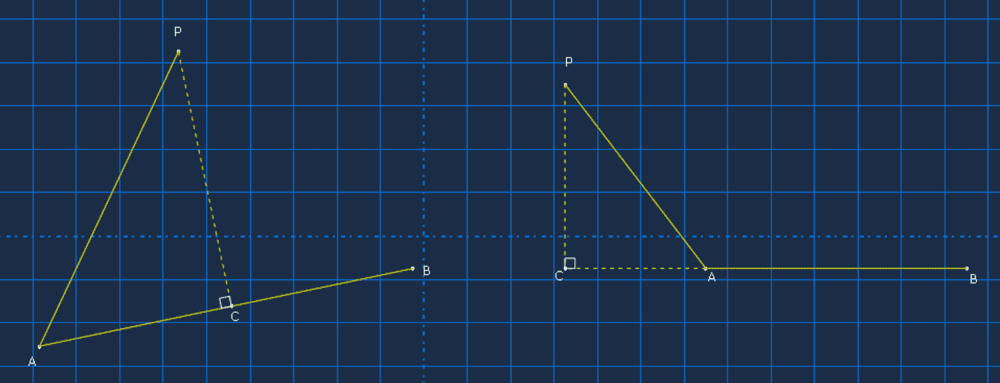

+++
title = "点到三角面片的距离"
summary = ""
categories = ["杂项"]
tags = []
series = []

lastmod = "2025-04-10T23:47:02+08:00"

date = "2025-04-10T23:47:02+08:00"
archives = '2025-04'
isCJKLanguage = true

params.math = true
+++

#### 1. 点到线段的距离

已知点P(x0, y0)、线段AB（A(x1, y1),B(x2, y2)），求点P到线段AB的距离。



设P在AB上的投影点为C，满足\(\overrightarrow{AC}=\lambda\overrightarrow{AB}\) （\(\lambda<0\)时C在AB延长线上且靠近A点，\(\lambda>0且\lambda<1\)时C在AB线段上，\(\lambda>1\)时C在AB延长线上且靠近B点）。取任意参考点作为原点O，变换成下式：

$$\overrightarrow{OC}=\lambda\overrightarrow{OB}+(1-\lambda)\overrightarrow{OA}$$

\(\lambda\)可用点积公式求出：

$$\lambda=\frac{\overrightarrow{AP}\cdot\overrightarrow{AB}}{|AB|^2}$$

代入上一个式子，可求出C点坐标。

点到线段的距离为：

$$
dist(P, 线段AB)=
\begin{cases}
|PA|, \lambda<0\\
|PC|, 0<=\lambda<=1\\
|PB|, \lambda>1
\end{cases}
$$

```cpp

```

#### 2. 点到三角形的距离
